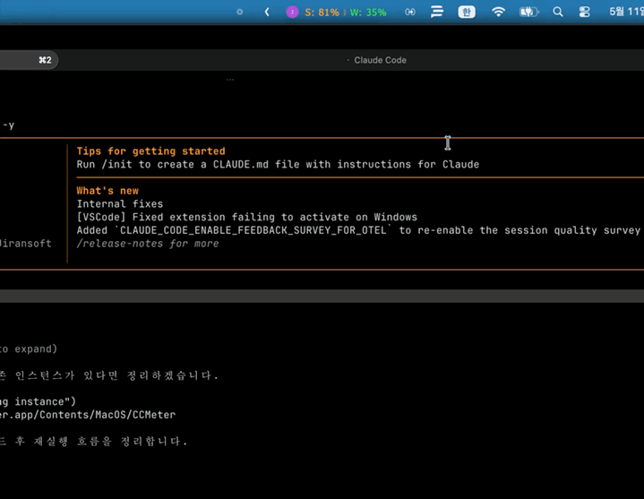

# CCMeter

macOS 메뉴바에서 Claude Code 계정을 전환하고, 계정별 5h/7d 사용량을 한눈에 확인합니다.

<p align="center">
  
  &nbsp;
  
</p>

## 기능

- 다중 Claude Code 계정 등록 · 1-클릭 전환
- 5h 세션 / 7d 주간 사용량 표시, 리셋 시각, 임계치 색상
- 메뉴바 라벨: 이니셜 · `S: nn%` · `W: nn%`
- Claude Code CLI 실행 중에는 전환 자동 차단

## 빌드

```sh
make app       # build/CCMeter.app
make install   # ~/Applications/ 설치
make run       # 빌드 후 실행
```

요구 사항: macOS 13+, Swift 6.0+. 안정 코드 사인을 원하면 `make setup-cert`.

## 저장소

자체 저장소 `~/.ccmeter/` 만 사용합니다.

```
~/.ccmeter/
├── accounts.json     # 등록된 계정
├── snapshots/<id>/   # 계정별 config·credentials·usage
├── backups/          # 활성 자료 timestamp 백업
├── settings.json
└── .lock
```

전환은 `flock` → CLI 실행 검사 → 활성 자료 백업 → atomic write → 검증 → 실패 시 자동 복원.

## 더 보기

- 설계 결정과 회귀 가드: [ARCHITECTURE.md](ARCHITECTURE.md)

## 라이선스

내부 도구.
